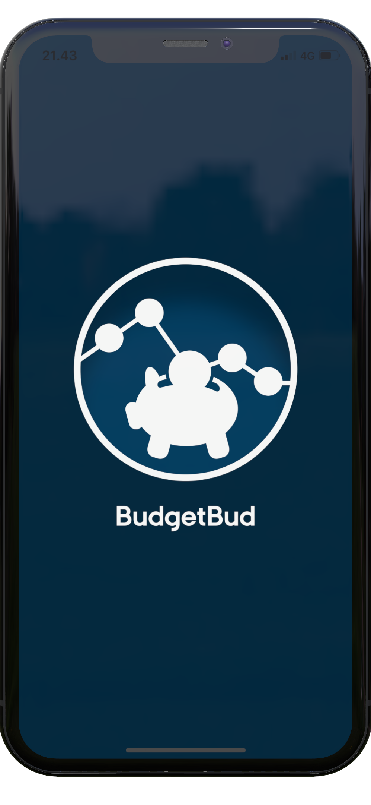
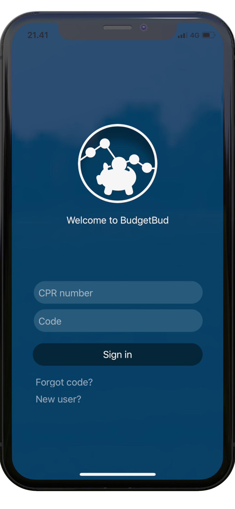

# 

BudgetBud is a budget management app for people having difficulities managing their economy and administering a budget on their own. It helps you manage your personal finances by allowing you to create a budget based on your current debt and desired monthly disposable amount. BudgetBud simply helps you live your life without worrying about your money.

# Implementation

Developed using React Native and Expo. Navigation is performed by React Navigation. The app makes requests to Firebase Cloud Functions and stores information in Firebase Cloud Firestore. Check out the code to learn more.

# Screenshots

